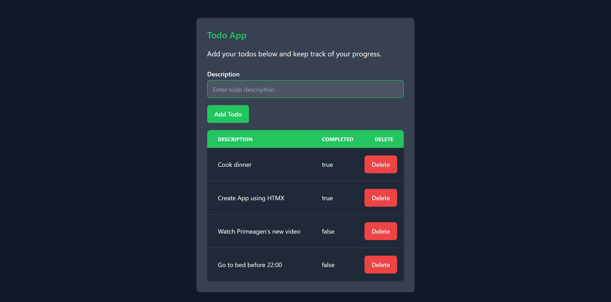

# Todos Tracking App using Go with [gin](https://gin-gonic.com/), [templ](https://templ.guide/), and [htmx](https://htmx.org/).


This is a simple todo application written in Go using the gin web framework, templ for templating, and htmx for seamless client-server communication. The goal of this project was to explore these technologies and gain hands-on experience with htmx, which piqued my interest due to its unique approach.

## Technologies Used:

- [Go](https://golang.org/): A powerful and efficient programming language.
- [gin](https://gin-gonic.com/): A web framework for Go, providing routing, middleware, and more.
- [templ](https://templ.guide/): A templating engine for Go that simplifies HTML generation.
- [htmx](https://htmx.org/): A JavaScript library for AJAX without writing JavaScript.

## Frontend Design

For the frontend, I opted for a hassle-free approach and used [v0](https://v0.dev/) by Vercel. This allowed me to focus more on the backend logic without delving into extensive frontend development.

## Installation

1. Clone this repository:

```bash
git clone https://github.com/kkoutsilis/todo-go-htmx.git
```

2. Navigate to the project directory:
```bash
cd todo-go-htmx
```

3. Install dependencies:
```bash
go get ./...
```

## Running the Application

1. Build and run the application
```bash
go run .
```

2. Open your web browser and navigate to http://localhost:8080 to access the app.

## Screenshots



## Future Development
As I am still relatively new to Go and its ecosystem, I plan to continue learning and expanding my skills in both backend and frontend development. Suggestions and contributions are welcome!

Feel free to reach out if you have any questions or feedback.
